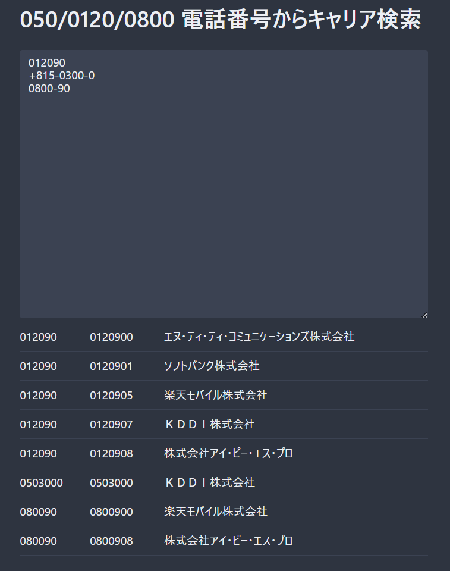

# 050/0120/0800 電話番号からキャリア検索

[電気通信番号指定状況](https://www.soumu.go.jp/main_sosiki/joho_tsusin/top/tel_number/number_shitei.html)を使って 050/0120/0800 を持つキャリアを検索



- 複数検索可能
- 5 文字以上入力することで検索開始

## 必要

- ruby
- [xlsx2csv](https://github.com/dilshod/xlsx2csv)

## データ更新

```shell
make
```

doc/index.html はローカルで利用可能
